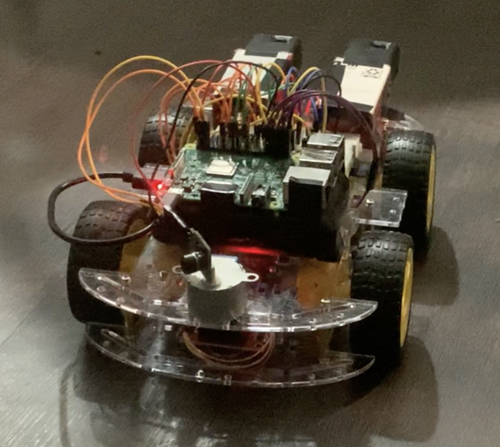
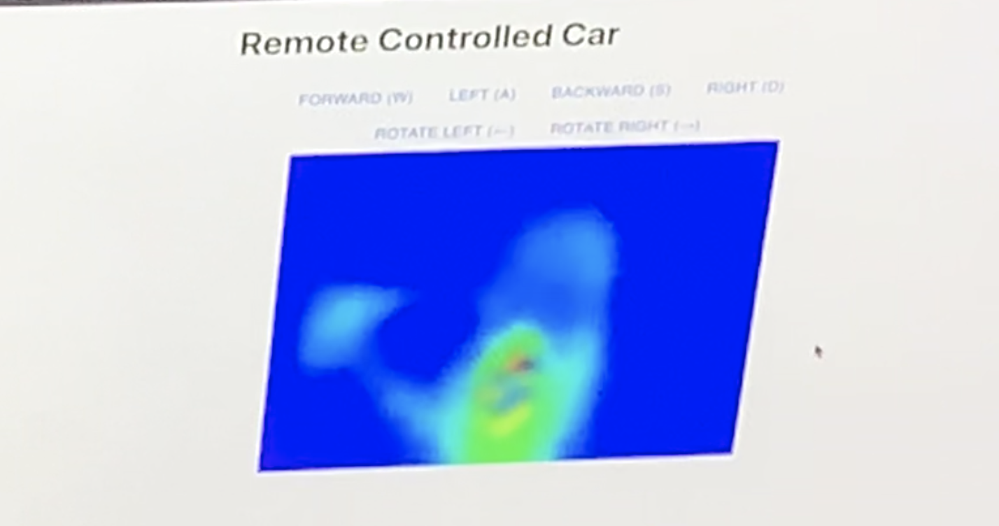

# Remote-Controlled Car with Thermal Imaging

This car is controlled completely wirelessly through a user interface. It can move in all four 
directions, and can stream thermal imagery of its surroundings in real-time. The thermal camera 
can pan around, capturing the surroundings in all directions.

This project demonstrates many hardware, embedded systems, and software-related skills. It was 
developed over the span of 3 weeks as part of my Microcomputer Systems (CSCE 462) course, and was 
regarded as one of the best projects.

  
  
  

## Hardware

The project utilizes the following hardware components:

- Raspberry Pi 3 (main controller)
- MLX90640 infrared camera (thermal imagery)
- Stepper motor (camera panning)
- Stepper motor controller (controlling the stepper motor)
- 4x DC motors (car movement)
- 2x L298N DC motor controllers (controlling the DC motors)
- 2x 9V batteries (powering the DC motors)
- 8x 3.3V to 5V level shifters - made up of 1 NPN BJT + 3 resistors (shifting logic levels from 
  Raspberry Pi's GPIO pins to DC motor controllers' logic pins)

## Software

The software components of the project include:

- Web-based user interface
  - React frontend
  - Flask backend
- Raspberry Pi server

When the user presses keys/buttons, the commands are streamed from the React frontend to the Flask 
backend, and are subsequently streamed to the server running on the Raspberry Pi. This server then 
controls the motors appropriately to move the car, or pan the camera.

As for the thermal imagery, the server captures the data from the camera in real-time, in a separate 
thread. Each frame is then forwarded to the Flask backend of the UI. Several image processing 
techniques such as normalization, interpolation, Gaussian blurring, and temperature scaling are 
applied to scale and smoothe each frame. Then, they are sent to the frontend to be displayed.

## Skills Involved

The following skills were involved in creating this project:

#### Hardware

- Interfacing with I2C devices (MLX90640 thermal camera)
- Controlling stepper motors through digital signals
- Using PWM to control DC motors
- Shifting voltage logic levels between two devices using BJTs and resistors

#### Software

- Sending/receiving appropriate signals from GPIO pins in order to move motors appropriately,
  and receive thermal imagery
- Real-time communication between Flask backend of UI and Raspberry Pi server
- Concurrently gathering and streaming thermal imagery data (multi-threading)
- Image processing (normalization, smoothing, and scaling)
- React (Javascript, HTML) and Flask (Python) for web-based UI
